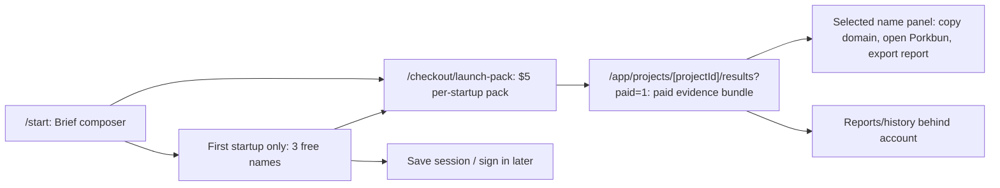

# Namelift Simple Paid Flow Redesign

## Phase 0: Scope And Baseline

User direction: stop treating Namelift like a command-center SaaS. Make it a premium, simple purchase flow: describe the startup, generate a once-ever first-startup preview, pay once per startup, receive names with evidence, then secure a domain or export a report. Payment processor integration remains deferred.

Current baseline observed on `http://127.0.0.1:3100` with screenshots saved in `output/simple-flow-audit/`:

- `/app` still has sidebar navigation, global search, notifications, profile menu, project dashboard, and duplicated project cards. It is functional, but it feels too heavy for a `$5` impulse product.
- `/start` renders, but it is surrounded by app chrome and looks like a settings form instead of the product's activation moment.
- `/checkout/launch-pack` works as a preview unlock, but the "Coffee Pack" name feels cheaper than the actual value and should not be the product-facing offer name.
- Mobile compresses the dashboard shell into a horizontal nav/search/account stack before the user can do the naming job.

Preserved product contract:

- Target user: solo founders, indie hackers, small studios, and builders who need a name quickly.
- Promise: generate names and screening signals, not legal clearance.
- Free value: the first startup only gets `3` names once ever.
- Paid boundary: one-time `$5` pack per startup for `50` names, up to `5` checked recommendations, and one evidence report.
- Deferred integrations: Lemon Squeezy or equivalent hosted/overlay checkout, production auth/restore links, live domain/social/trademark APIs, and Porkbun purchase/deeplink wiring.

Changed by explicit user direction:

- Dashboard is no longer the primary experience.
- Login is not first. Account/history is secondary and can stay tucked behind a small account/menu.
- Naming and checks are one paid deliverable, not separate products.
- After the first startup preview is used, every new startup goes to account/payment before generation.
- Payment language moves from "Coffee Pack" to plain value: "Unlock 50 + checks for $5."

## Phase 1: Research Signals

Sources and extracted principles:

- Brandize (`https://brandize.me/`) puts the creation form and "$5 one-time" promise directly on the first screen. Principle: a low-priced AI utility should show the input and deliverable immediately.
- Marc Lou portfolio (`https://marclou.com/`) lists small focused products such as ShipFast, PoopUp, and LogoFast. Principle: these products sell a blunt outcome and simple access model rather than a dashboard.
- LogoFast (`https://logofast.app/`) is a focused tool: creation controls first, export/value second, no account-first workflow. Principle: make the tool the product.
- Lemon Squeezy checkout overlay docs (`https://docs.lemonsqueezy.com/help/checkout/checkout-overlay`) show a hosted/overlay checkout pattern that keeps card handling out of the app and can be initialized after React mount.
- Lemon Squeezy checkout API docs (`https://docs.lemonsqueezy.com/api/checkouts/the-checkout-object`) support embedded/overlay checkout configuration, product options, and redirect URLs.
- Porkbun API docs (`https://porkbun.com/api/json/v3/documentation`) and spec (`https://porkbun.com/api/json/v3/spec`) support server-side domain availability checks. The implementation must keep keys server-side and treat availability as a signal, not a legal determination.
- 21st.dev components (`https://21st.dev/community/components`) and docs (`https://help.21st.dev/`) are useful visual references, but this repo is CSS Modules rather than Tailwind/shadcn.
- Apple design tips (`https://developer.apple.com/design/tips/`) reinforce clarity, deference, and direct manipulation. Principle: reduce chrome and make the current task obvious.

Research decisions:

- Do not add Tailwind/shadcn/21st.dev for this pass.
- Do not build custom card fields; later production should redirect/open hosted checkout.
- Do not expose Porkbun API keys client-side.
- Do not promise "available," "cleared," or "safe"; use "signal," "risk," and "screening."

## Phase 2: Personas And Problem Framing

Primary proto-persona: "Weekend founder"

- Trigger: has an idea and needs a name today.
- Anxiety: wasting time on weak names or accidentally picking a risky/conflicting name.
- Behavior: wants the shortest path, will pay `$5` if the result looks useful and concrete.
- Success: a shortlist with evidence and a next action to register a domain.
- UX implication: no dashboard, no plan comparison, one visible action per screen.

Secondary proto-persona: "Studio/product operator"

- Trigger: needs options for multiple client or internal concepts.
- Anxiety: messy history and poor evidence trails.
- Success: repeatable reports and recoverable past projects.
- UX implication: history/report/settings exist, but they belong behind account/history, not persistent nav.

Problem statement:

Namelift should feel like a premium naming flow, not a SaaS admin panel. The interface must make the path obvious in five seconds: brief -> first preview or $5 pack -> evidence -> choose/secure.

## Phase 3: Inspiration And Anti-Patterns

Reusable principles:

- Focused creation tools put the input in the first viewport.
- One-time purchase flows sell a deliverable, not an abstract plan.
- Premium utility UI uses restraint: strong typography, careful spacing, quiet borders, and one dominant action.
- Evidence results should look like a research table/dossier, not a celebration wall.

Rejected anti-patterns:

- Dashboard sidebar as the first screen.
- Global search, notifications, account menu, and settings before the user has results.
- Repeated "Coffee Pack" buttons.
- Fake paper, fake tape, CSS-drawn decorative assets, blobs, and purple SaaS gradients.
- Green legal-clearance semantics.
- Filters/sidebar controls in the 3-name first-startup preview state.

## Phase 4: UX Flow And Wireframes

Primary route flow:

Desktop wireframe:

- Thin top header with logo, progress steps, one account/history control.
- Brief screen: two-column layout, large left form, small right "what you get" evidence list, one primary CTA.
- First preview results: 3 name cards/grid/list, shortlist affordance, one sticky bottom unlock bar after the preview.
- Checkout: account gate, value column, order summary, hosted checkout placeholder. Copy says payment integration is pending for this build.
- Paid bundle: ranked evidence table/list, selected-name side panel, "Secure domain" and "Export report" actions.

Mobile wireframe:

- Header with logo/menu only.
- Single-column brief fields.
- Results cards stacked with a bottom sticky action bar.
- Paid evidence screen uses cards first and a selected-name sheet/panel rather than dense sidebars.

State inventory:

- First run: brief screen with prefilled demo text only for local testing.
- Loading: generation/checking progress with stages.
- First startup preview: `3` names, shortlist/save, screening preview only.
- Later unpaid project: no names generated; show pack-required state and checkout CTA.
- Paywall: one `$5` CTA and clear deliverables.
- Paid: `50` names available/generated, checked recommendation signals, report export, Porkbun action.
- Error/recovery: inline error notice, "start a new brief," "return to starter results."

## Phase 5: Conversion Funnel

Selected offer:

- Free: `3` names for the first startup only, once ever.
- Paid: `$5` one-time pack per startup.
- Paid deliverable: `50` names, screening signals, `5` checked recommendations, and one evidence report.
- Repeat use: buy another pack for another startup; no subscription tier or credits in this pass.

Value copy:

- "Generate 3 free names for your first startup."
- "Unlock 50 + checks for $5."
- "No subscription. No card before the first-startup preview."
- "Screening signals, not legal advice."

Analytics events to add later:

- `brief_started`
- `starter_generated`
- `starter_shortlisted`
- `checkout_started`
- `checkout_completed`
- `bundle_generated`
- `domain_action_clicked`
- `report_exported`

## Phase 6: Visual Direction And Mockups

Generated mockups are stored in `/Users/jadanjones/.codex/generated_images/019e71d1-66f4-7dc0-837d-254cf19ac2db/`:

- Direction 1: `ig_0129ce10ae26f285016a192f6a8ca88197b925e7a70934b4b9.png`
- Direction 2: `ig_0129ce10ae26f285016a1930477d588197981699cbcc709ac1.png`
- Direction 3: `ig_0129ce10ae26f285016a1931245fc4819785bc9ef8af101e6b.png`
- Direction 4: `ig_0129ce10ae26f285016a1931fd37b88197816a844d35b082d6.png`

Selected direction: blend Direction 1 and Direction 3.

Why:

- Direction 1 has the clearest end-to-end flow and mobile sticky CTA.
- Direction 3 has the strongest paid evidence report and selected-name side panel.
- Direction 4 is elegant but risks overloading the first screen with three panes.
- Direction 2 is usable but still has too many visible frames/cards and too much "Coffee Pack" language.

Visual thesis:

Namelift is a premium utility for one high-stakes micro-decision. The UI should feel quiet, sharp, and direct. Names and evidence are the visual material. Surfaces are mostly white/off-white with black text, hairline borders, restrained shadows, and one blue action. Status colors are muted and factual.

Implementation tokens:

- Background: `#f6f6f3` / `#fafafa`
- Ink: `#080b10`
- Muted: `#667085`
- Line: `#e4e7ec`
- Primary: `#075cff`
- Radius: `10px` for app cards, `999px` for pills, no oversized novelty cards.
- Typography: existing system stack, larger editorial name display for generated names, compact evidence text.
- Motion: subtle loading/progress only through existing `motion`, no decorative animation.

## Phase 7: Resource Viability

Selected resources:

- Existing Next 15, React 19, CSS Modules, zod, lucide, and Motion.
- lucide icons for UI controls only.
- Native semantic forms/tables for this pass.
- Hosted/overlay checkout later via Lemon Squeezy.
- Porkbun action as an external link/search URL placeholder in this pass; API integration remains server-side future work.

Rejected resources:

- Tailwind/shadcn/21st.dev: too much churn for a CSS Modules app.
- React Aria/TanStack/cmdk: useful later if menus/tables/search grow, but the current simplified flow can stay custom and semantic.
- Raw SVG/CSS assets: violates the resource plan and was the source of the previous cheap look.
- Generated decorative assets: not needed for this selected direction.

## Phase 8: Implementation Plan

1. Rework `src/app/product/app-client.tsx` so primary product routes use a slim `FlowShell`, not `AppShell`.
2. Make `/app` a lightweight history/start page, not the first-class dashboard.
3. Redesign `/start` and `/app/new/describe` as the brief composer.
4. Redesign results as free starter vs paid evidence bundle with selected-name panel and Porkbun/report actions.
5. Simplify checkout copy, add account-before-payment gating, and remove "Coffee Pack" from product-facing primary labels.
6. Keep secondary routes functional but quiet: saved/reports/settings stay accessible from history/account, not persistent nav.
7. Update docs/frontend route-map and asset manifest.
8. Verify with `pnpm verify`, `pnpm build`, `pnpm frontend:qa`, Playwright click-through, desktop/mobile screenshots.

## Critique Checklist

- One dominant CTA per screen.
- No dashboard sidebar in the core flow.
- The brief screen is the strongest screen.
- The starter results are about names, not filters.
- Paid value is one sentence.
- "Coffee Pack" does not appear as repeated UI branding.
- No fake CSS/SVG assets.
- Mobile has a bottom sticky action bar.
- Screening language never implies legal clearance.
- The final paid screen includes report export and a Porkbun/domain next action.
